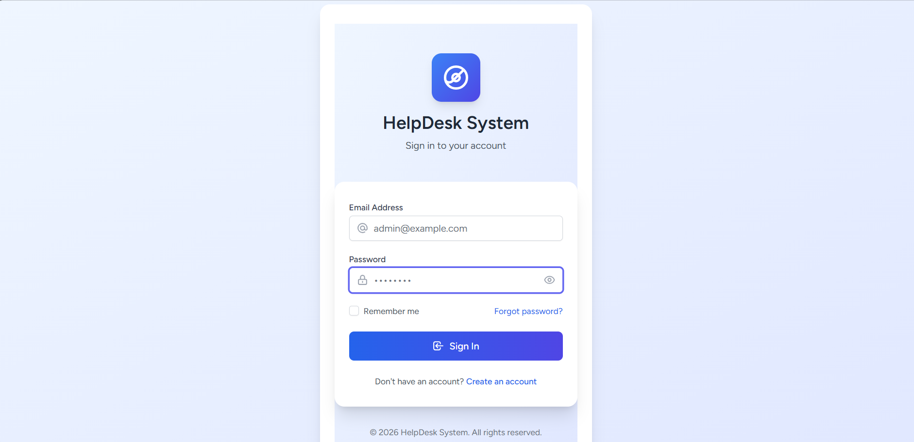
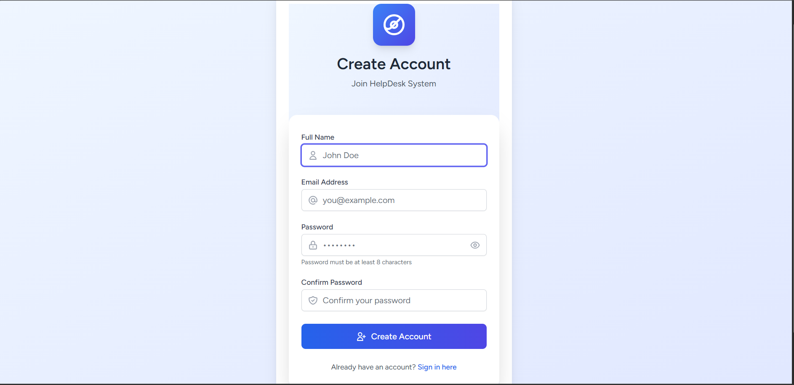
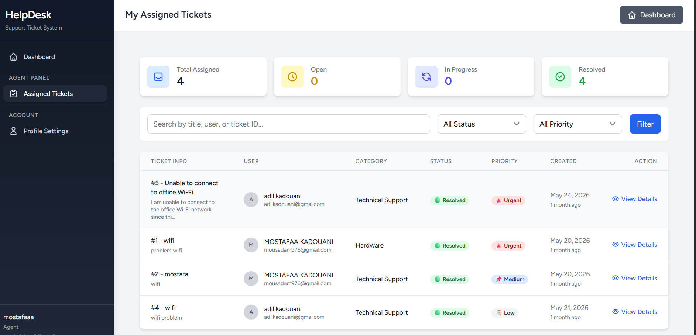
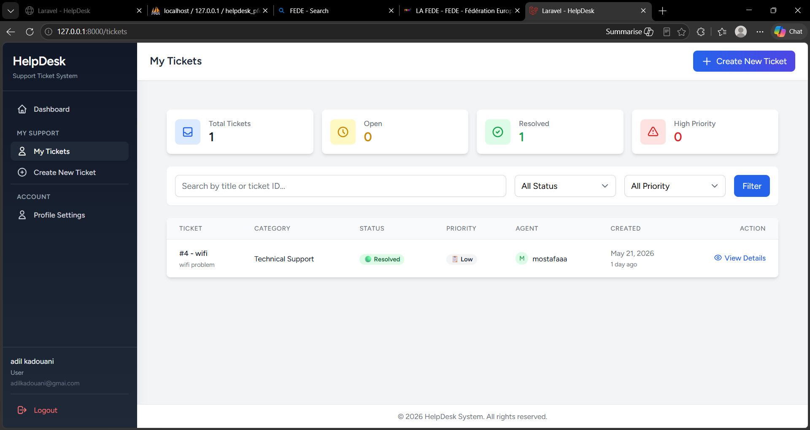
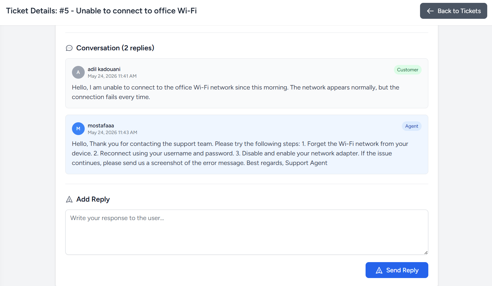

# 🚀 HelpDesk Ticket Management System

A modern HelpDesk Ticket Management System built with **Laravel 12**.

---

## ✨ Features

- 🔐 User Authentication
- 🎫 Create & Manage Tickets
- 💬 Ticket Conversations
- 👨‍💼 Admin Dashboard
- 👨‍🔧 Agent Dashboard
- 📂 Categories Management
- 👥 User Management
- 📊 Ticket Statistics
- ⚡ Priority Levels
- 📎 File Attachments
- 🔍 Search & Filter Tickets

---

## 🛠 Tech Stack

- Laravel 12
- PHP 8.2
- MySQL
- Blade
- Tailwind CSS
- JavaScript

---


## 📸 Screenshots

### 🔐 Login



### 📝 Register



### 👨‍💼 Admin Dashboard


### 👨‍🔧 Agent Dashboard



### 🎫 My Tickets



### ➕ Create Ticket


### 💬 Ticket Conversation



### 📂 Categories Management


---

## ⚙️ Installation

```bash
git clone https://github.com/Mous20/helpdesk-system.git

cd helpdesk-system

composer install

cp .env.example .env

php artisan key:generate

php artisan migrate --seed

php artisan serve
```

---

## 📈 Future Improvements

- Email Notifications
- Live Chat
- REST API
- Dark Mode
- Mobile Optimization

---

## 👨‍💻 Author

**Mostafa Kadouan**

GitHub: https://github.com/Mous20
